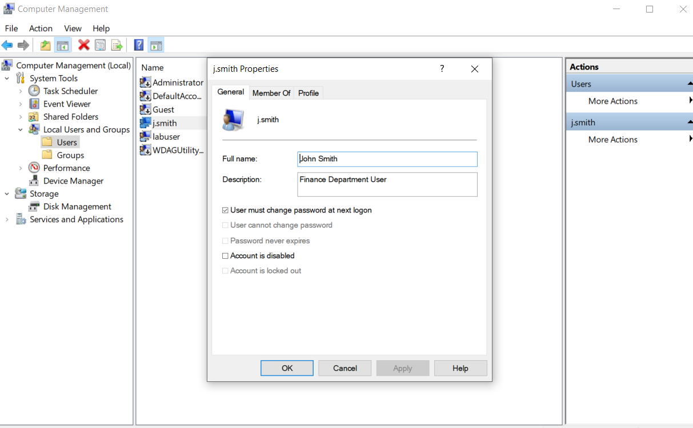
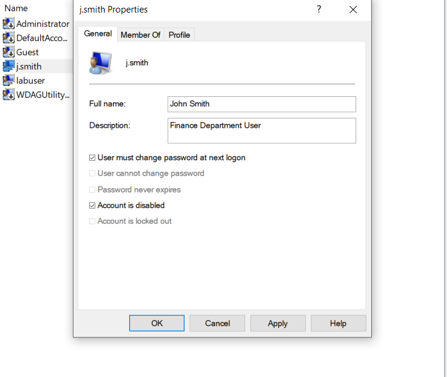
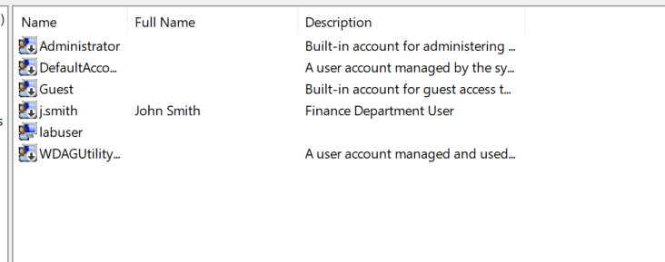
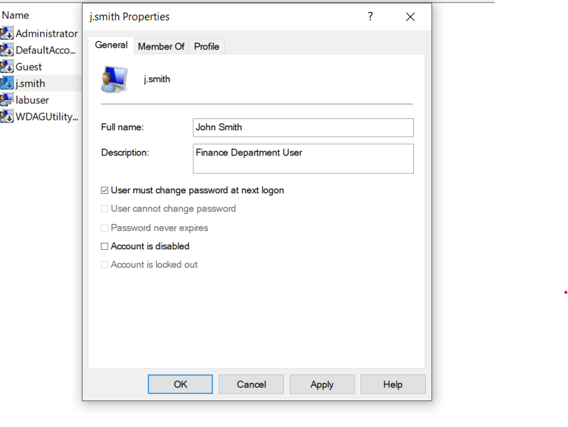
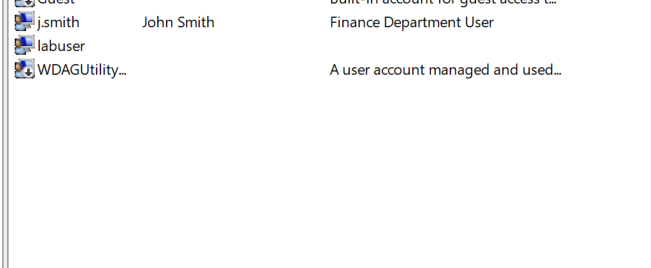
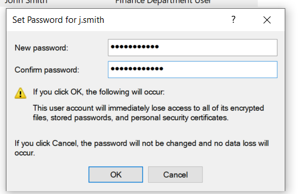

# 🖥️ IT Support Ticket 003 – Manage Local Windows User Account

## 📌 Objective

This lab demonstrates how to manage a local Windows user account using Windows Computer Management.

The objective was to perform common IT Support administrative tasks, including viewing user properties, disabling and enabling a user account, and resetting the user's password.

---

## 🛠️ Environment

- Operating System: Windows 10
- Tool: Computer Management
- Feature Used: Local Users and Groups

---

## 🎯 Tasks Performed

- Viewed user account properties
- Disabled a local user account
- Verified the account was disabled
- Re-enabled the user account
- Verified the account was enabled
- Reset the user's password
- Confirmed successful password reset

---

## 💼 Skills Demonstrated

- Windows Administration
- User Account Management
- Password Administration
- Help Desk Support
- Desktop Support
- IT Troubleshooting

---

## 🚀 Key Takeaway

Managing local user accounts is a common responsibility for IT Support Technicians. This lab demonstrates the process of controlling user access, verifying account status, and performing password administration using Windows Computer Management.

---

## 📸 Screenshots

### 1. User Properties

### 2. User Account Disabled

### 3. Disabled Account Confirmation

### 4. User Account Enabled

### 5. Enabled Account Confirmation

### 6. Password Reset Window

### 7. Password Reset Successful

---

## 🎥 Video Demonstration

Watch the complete walkthrough on YouTube:

https://youtu.be/SkYLDksYxwY
